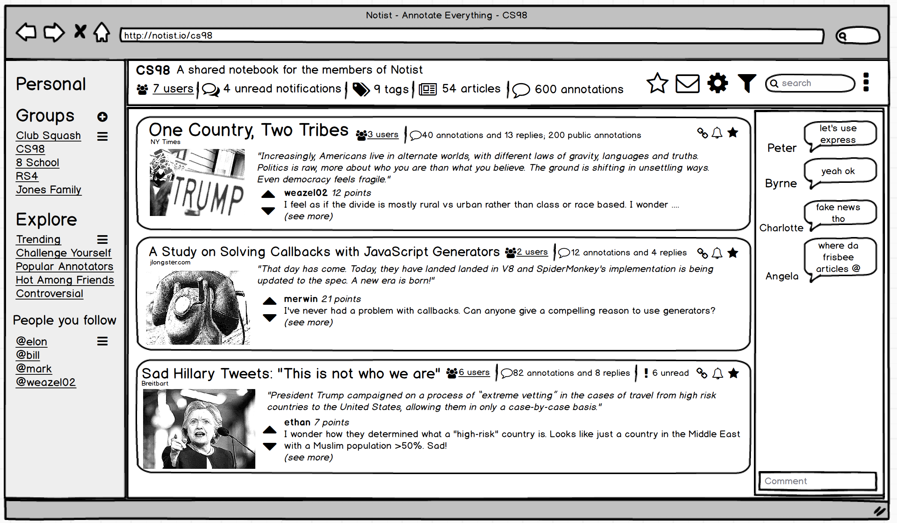

# Pitch

The Internet is such a vast collection of ideas and information that it’s easy to miss things that are relevant to you, forget about interesting things you read, or get stuck in a bubble of homogeneous opinions. Our goal is to facilitate the process of acquiring, synthesizing and annotating online information about any topic, for anyone who is looking for a more interesting and principled way to browse the web.

To address this issue, we are creating an annotation tool called Notist that lets people annotate sites and share them in groups or keep them in a personal notebook. We hope to do this by creating a Chrome browser plugin and companion website. On the website's dashboard, we will allow for the creation of various groups or personal notebooks where annotations and discussions are shared. When you view the article on the web, annotations from previous readers automatically load.

Unlike other web annotation services, we would also like ours to have a major social component. For example, friends could create readings list where they recommend each other articles and share notes. Users also follow other people using the platform to see what they’re reading and how they’re reacting. We would also like to create a social recommendation engine that pushes users to read articles they wouldn’t typically come across.

Our target users are anyone and everyone who want to organize, annotate, and share their online browsing.

# Broader Impact

We think that the most popular current methods of discovering web content, namely Google and Facebook, tend to push users toward consuming information that reinforces their existing viewpoints, and also do not help users remember things they saw even a few days ago. Furthermore, no productive discussion about online content ever takes place, since Internet users often end up operating in an echo chamber of their like-minded peers. Notist will allow Internet users to find content that appeals to them and may also broaden their perspectives, and then participate in a conversation about said content with their friends or with the entire Notist community.

# Strategy
We will first create a REST API with Node and Express for adding and deleting website annotations and storing them in a RethinkDB database. We will then make a Chrome extension using Javascript which will allow a user to annotate webpages. Next, in the web application, we will add functionality that allows users to organize their annotations into notebooks. We aim to have this minimum viable product by the end of this term.

We plan on doing pair programming and we will have code review sessions which will ensure proper testing of code. We will also use test-driven development and write automated tests using Javascript testing frameworks.

# Implementation
We will use the React and Redux JavaScript libraries for creating frontend UI components and managing application state. Our design will be based on Google’s material design UI. We will have a backend Node server hosted on Heroku and a RethinkDB database. Our primary source of data will be from the notes and annotations that users create with our Chrome extension while visiting a web page. We will use PassportJS for social network integration and managing authentication. We will use git for version control.

# Originally a feature of the web
> Back in 1993, when Eric Bina and I were first building Mosaic, it seemed obvious to us that users would want to annotate all text on the web—our idea was that each Web page would be a launchpad for insight and debate about its own contents. So we built a feature called “group annotations” right into the browser—and it worked great—all users could comment on any page and discussions quickly ensued. Unfortunately, our implementation at that time required a server to host all the annotations, and we didn’t have the time to properly build that server, which would obviously have had to scale to enormous size. And so we dropped the entire feature.

-- Marc Andreessen for [*Business Insider*](http://www.businessinsider.com/theres-a-feature-that-was-supposed-be-in-web-browsers-from-the-very-beginning-but-it-was-dropped-at-the-last-minute-2012-10)

<!-- Text can be **bold**, _italic_, or ~~strikethrough~~. -->

### Group view mockup

### Hypothes.is group view

